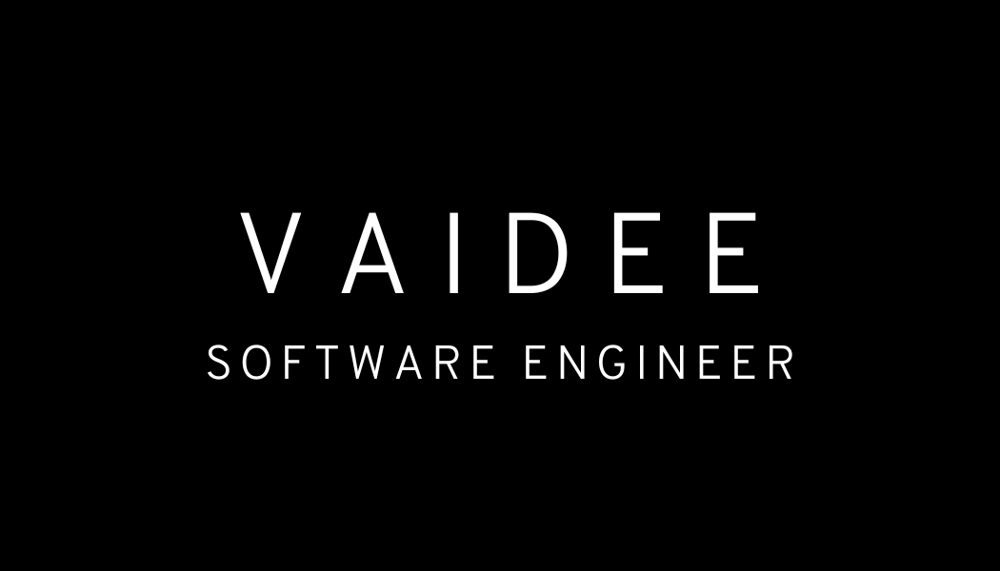

<h1 align="center">Hi 👋, I'm Vaideeswaran Chandrasekaran</h1>
<h3 align="center">A developer from India</h3>

I'm Vaidee, a developer by day, caffeine enthusiast by night, and a firm believer that semicolons are the real superheroes of programming🦸‍♂️.   When I'm not wrestling with bugs or engaged in an epic battle with my keyboard, you'll find me exploring the latest memes or contemplating the meaning of life in commit messages.   My code is like a fine wine - it gets better with time, and occasionally, it makes me question my life choices. 🍷

 
  

  

- 🌱 I’m currently into project mode in **MERN**

- 💬 Ask me about **Java, Javascript, React and NodeJS**

- 📫 How to reach me **vaideeswaran.c23@gmail.com**

- 🐦 Reach out on **[Twitter](https://twitter.com/crimson__king_)**
