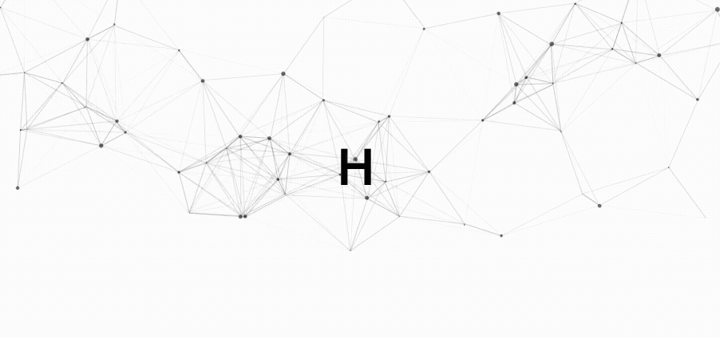

  

## About Me

I'm a passionate backend engineer specializing in building **scalable, reliable, and high-performance** backend solutions. I focus on designing systems that can handle growth, maintain efficiency, and deliver exceptional performance at scale.

## 📫 Let's Connect

- LinkedIn: [linkedin.com/in/vaideeswaranc](https://linkedin.com/in/vaideeswaranc)
- Email: vaidee.work@gmail.com
- Portfolio: [vaideeswaran.com](https://vaideeswaran.com)
- X: [x.com/vaideeswaran23](x.com/https://x.com/vaideeswaran23)
---

 

  

 

  

*"The best backend is the one users never have to think about - it just works, scales, and delivers."*